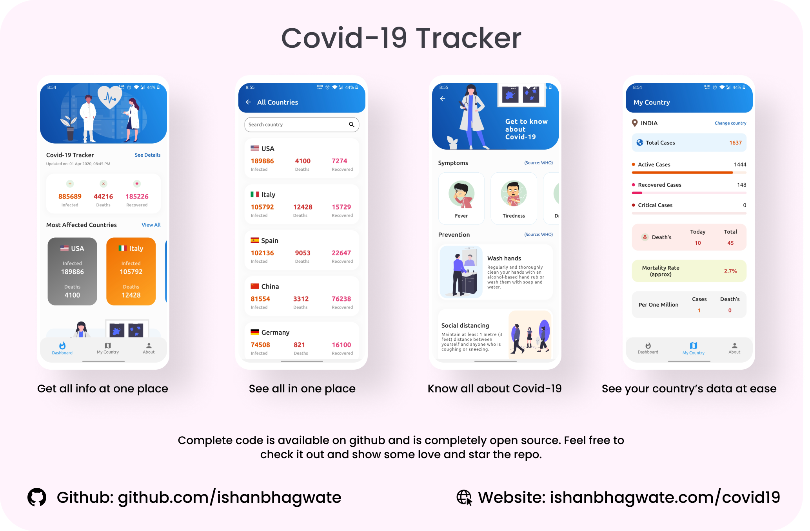

<h1 align="center">Welcome to covid_19_tracker 👋</h1>

  
  

> An app that tracks all the COVID-19 information around the world. App shows you complete report of all affected coutries and global status as well. It is built using Flutter framework which helps ease the process of building beautiful designs.

Download the app from [here](https://ishanbhagwate.com/covid19).

## Screenshots

## Building

Android (armeabi-v7a): `flutter build apk` 
Android (arm64-v8a): `flutter build apk --target=android-arm64` 
iOS: `flutter build ios` 

If you have a connected device or emulator you can run and deploy the app with `flutter run` 

## Author

👤 **Ishan Bhagwate**

* Website: [@ishanbhagwate.com] (https://ishanbhagwate.com)
* Twitter: [@b2x\_codes](https://twitter.com/b2x\_codes)
* Github: [@ishanbhagwate](https://github.com/ishanbhagwate)
* LinkedIn: [@ishan-bhagwate](https://linkedin.com/in/ishan-bhagwate)

### :heart: Found this project useful?

If you found this project useful, then please consider giving it a :star: on Github and sharing it with your friends via social media.

# Donate

> If you found this project helpful or you learned something from the source code and want to thank me, consider buying me a cup of :coffee:
>
> - [PayPal](https://www.paypal.me/ishanbhagwate/)

A few resources to get you started if this is your first Flutter project:

* [Lab: Write your first Flutter app](https://flutter.dev/docs/get-started/codelab)
* [Cookbook: Useful Flutter samples](https://flutter.dev/docs/cookbook)

For help getting started with Flutter, view our
[online documentation](https://flutter.dev/docs), which offers tutorials, 
samples, guidance on mobile development, and a full API reference.

